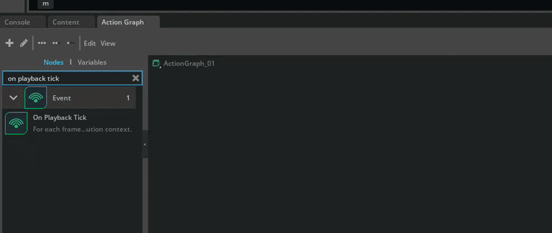
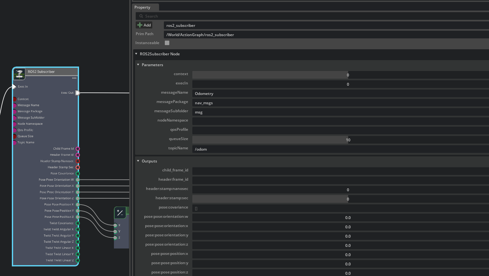
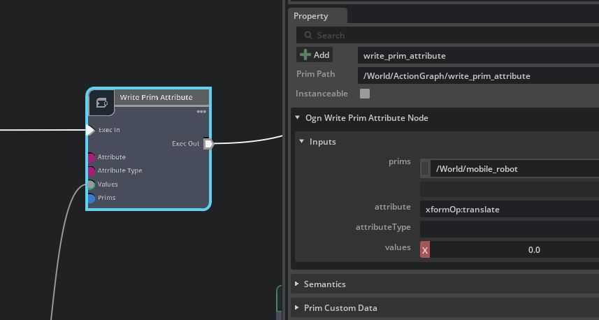
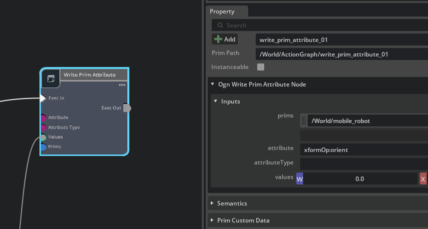
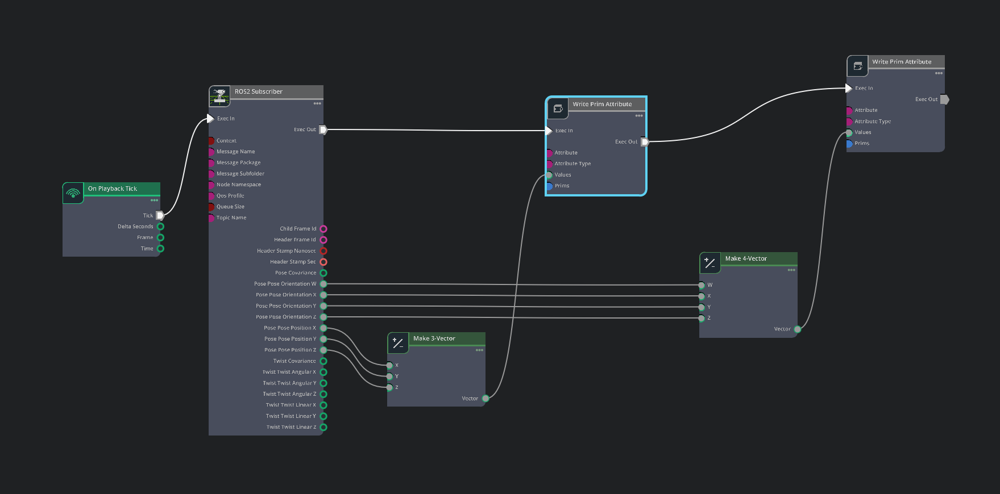

# 🏎️ Controlling car using encoder values (optional)

> **Note:** If you want to achieve more accurate movement and eliminate the gap between hardware and software, use this method to lock your Digital Twin to reality. 🎯

## 🛠️ Implementation Steps

### 1️⃣ Update the Python Controller 🐍

To get the most precise movement, the physical car must act as the "Source of Truth."

- **Enable Odom:** Its already there on the motor_bridge.py code on your hardware to activate odometry tracking.
- **ROS2 Integration:** The code now calculates position based on raw encoder ticks and publishes it to the `/odom` topic.

### 2️⃣ Configure the Action Graph 📡

In Isaac Sim, we built a bridge to listen to the physical car. This ensures the simulation mirrors every move the real car makes.

## The Node Setup:

### 🕒 On Playback Tick:

Keeps the synchronization alive in real-time.

### 📨 Ros2 Subscriber:

Listens for the incoming encoder-based odometry data.

### 🧩 Make 3-vector & Make 4-vector:

> Takes the raw translation and rotation data and formats them for the simulation.

### 📍Write Prim Attribute1:

### 📍Write Prim Attribute2:

_Directly updates the Digital Twin’s position and orientation attributes to match the hardware._

### 3️⃣ Real-Time Sync 🔄

> **\*The Flow:** Physical car moves ➡️ Encoders trigger data ➡️ ROS2 sends it ➡️ Action Graph catches it ➡️ Digital Twin teleports to the exact same spot.\*

---

## 🏗️ Technical Workflow

| Step           | Action             | Result                                 |
| :------------- | :----------------- | :------------------------------------- |
| **Hardware**   | Read Encoder Ticks | High-accuracy distance tracking 📏     |
| **Middleware** | ROS2 Publish       | Real-time data streaming ⚡            |
| **Simulation** | Action Graph Logic | Digital Twin snaps to physical pose 🤖 |

---

**Current Project Status:** We have successfully connected the digital twin and can now control it based on real-world encoder values. The movement is now synced 1:1. 🏁

---

### [⬅️ Previous](./hardware_integration.md) | [Next ➡️](./finalpage.md)
