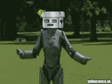

# 🎬 Final Result & Demonstration

### 🚀 Digital Twin in Action

- Left → Real Robot (Hardware)
- Right → Isaac Sim (Simulation)
- Both respond to the same keyboard input

## 🎯 What This Project Achieves

### Real-time Simulation ↔ Hardware synchronization

### Control using ROS 2 (keyboard + joystick)

### Accurate digital twin representation

### Scalable for future robotics applications

## 🧠 Key Learnings

- ROS 2 communication (/cmd_vel)
- Isaac Sim / Action Graph
- Hardware-software integration
- Real-world robot control

## 🚀 Future Project Opportunities

_Based on this digital twin system, the following projects can be developed further:_

1. **🤖 Autonomous Navigation System**  
   _Implement SLAM and path planning to make the robot move without manual control_
2. **📡 Remote Monitoring & Control Dashboard**  
   _Build a web/mobile app to control and monitor robot data in real-time_
3. **🧠 AI-Based Object Detection & Tracking**  
   _Integrate camera with AI models to detect and follow objects_
4. **⚙️ Predictive Maintenance System**  
   _Use sensor + encoder data to predict motor or hardware failures_
5. **🏭 Industrial Digital Twin Applications**  
   _Extend this system for warehouse robots or factory automation_

#### 🏁 Conclusion

_This project demonstrates how a digital twin system can bridge simulation and real-world robotics using ROS 2 and Isaac Sim._

## 🙌 Credits / Acknowledgment

## ⭐ Support

_If you found this project useful:  
👉 Star ⭐ the repository_

## 

### [🏠Home ➡️](../README.md)
