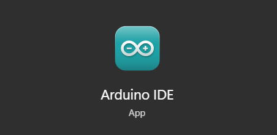
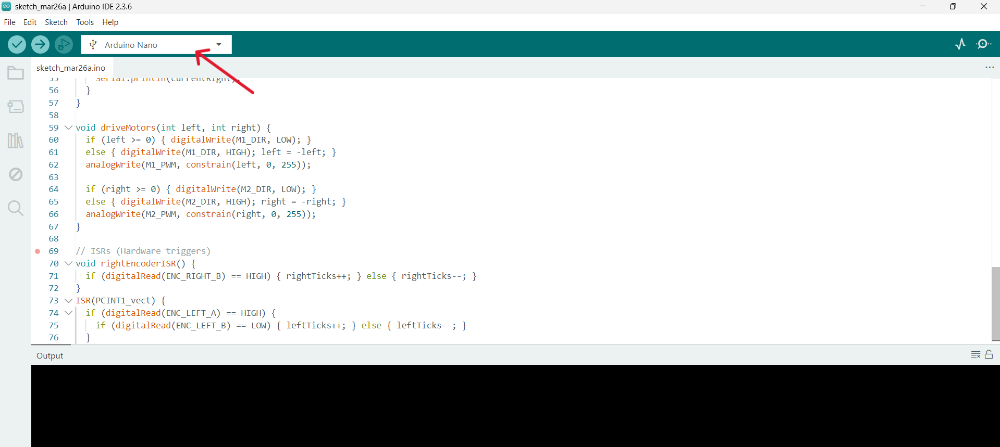
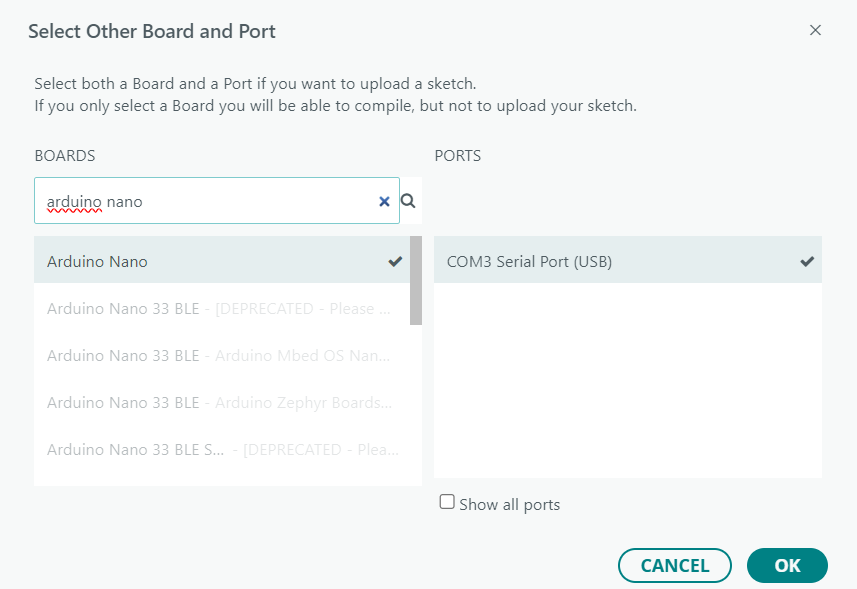
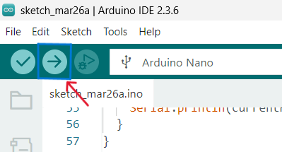

# 🤖 Hardware Integration & Control

After setting up Raspberry Pi and ROS 2, the next step is to connect and control the physical robot hardware.

## 🔌 Upload Code to Arduino Nano

### 1. Open Arduino IDE



### 2. Click Select Board



### 3. Select Board & Port _(Arduino Nano - COM3 Serial Port (USB))_



### 4. Paste this code: [motor_control.c++](../a_nano.c++)

### 5. Upload the Code



_This code is responsible for controlling the motors_

### 🍓 Setup Raspberry Pi Control

- Place the following file in your Raspberry Pi:
  [motor_bridge.py](../motor_bridge.py)
- This script acts as a bridge between ROS 2 and Arduino

```bash
nano motor_bridge.py #paste the motor_bridge.py here

sudo chmod a+rw /dev/ttyUSB0 #grants permission to access USB

python3 motor_bridge.py #starts communication with Arduino

```

### 🎮 Control Using Keyboard

- Run ROS 2 keyboard control (same as simulation)
- The physical robot will start responding to commands

### 🔁 Simulation + Hardware Sync


- Both Isaac Sim (digital twin) and real robot work together
- Commands are shared using ROS 2

### ✅ Outcome

- Arduino and Raspberry Pi successfully connected
- Hardware responds to keyboard input
- Simulation and real robot run simultaneously

---

## ⚡ What to Do Next

- Read encoder values from physical robot
- Send data to ROS 2 for processing
- Update Action Graph to use encoder feedback
- Sync digital twin movement with real robot 🔁

### [⬅️ Previous](./bot_hardware.md) | [Next ➡️](./encoder_motor.md)
