# Option 3: Want to build the robot from scratch? (Manually)

- 🛠️ Build a Simple Mobile Robot (Manual – Learning Purpose)
- ⚠️ This is a basic model for learning Isaac Sim.
- 👉 It is not an accurate or realistic robot, just to understand fundamentals.

## 🧱 Create Basic Structure

### 1.Create → Physics → Physics Scene

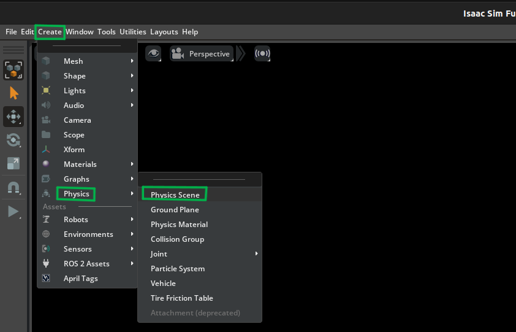  
_Initializes a physics simulation environment to enable realistic physical interactions within the scene._

### 2.Create → Physics → Ground Plane

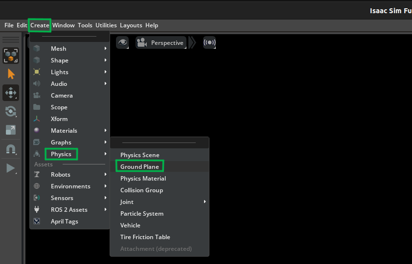  
_Adds a ground surface to the scene to provide a stable reference and enable collision interactions with objects._

### Add body: Create → Shape → Cube

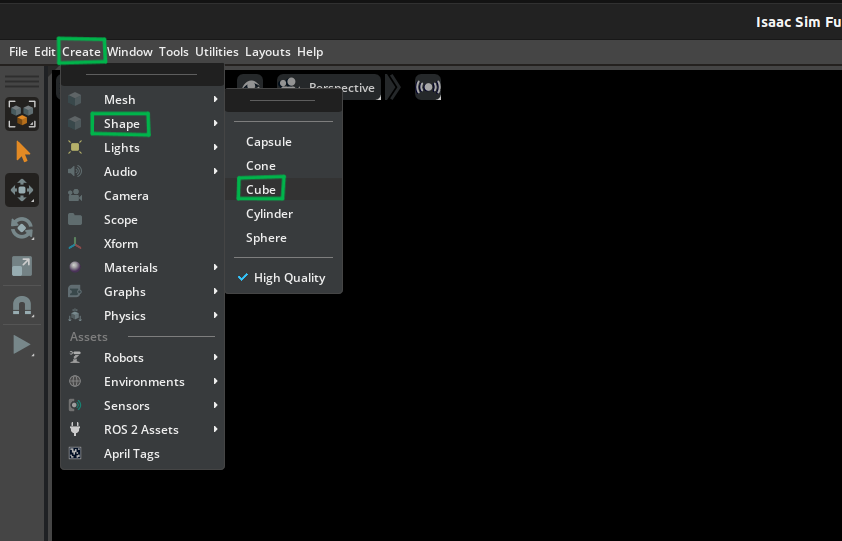  
_Creates a cube primitive to serve as the main body structure of the mobile robot within the simulation._

### Set: Translate Z = 1.0, Scale = (2,1,0.5)

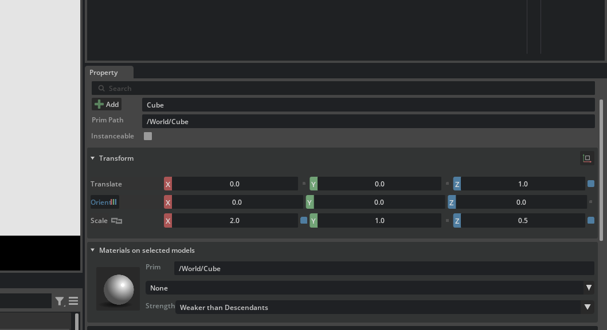  
_Adjusts the body’s position and dimensions to elevate it above the ground and define the desired size and proportions of the mobile robot._

### Add wheel: Create → Shape → Cylinder

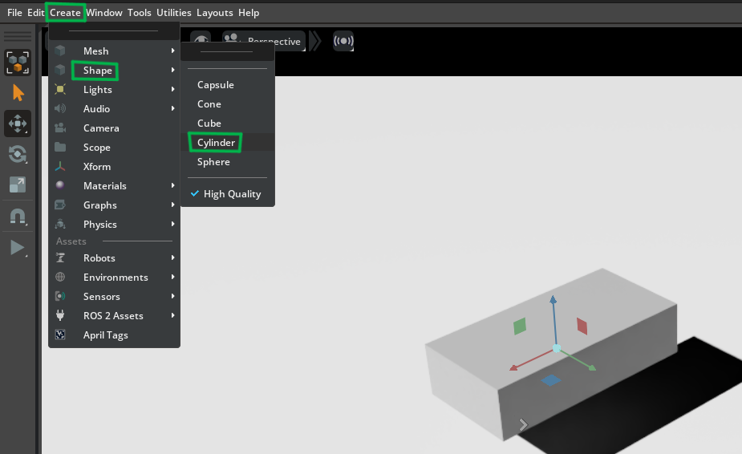  
_Creates a cylindrical primitive to represent the wheel component of the mobile robot for movement simulation._
**Set:**
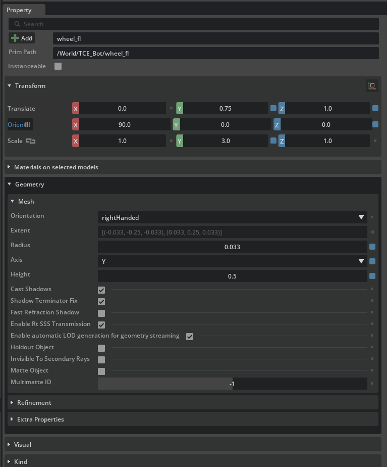
Height = 0.5  
Translate = (0, 0.75, 1.0)
Rotate = (90, 0, 0)
Scale = (1,3,1)
Rename → left_wheel

### 🔁 Duplicate Wheel do the same steps

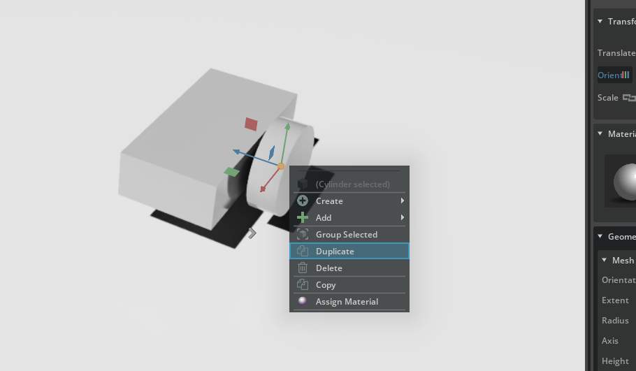  
Duplicate left_wheel
Change: Translate Y = -0.75
Rename → right_wheel

### ⚙️ Add Physics

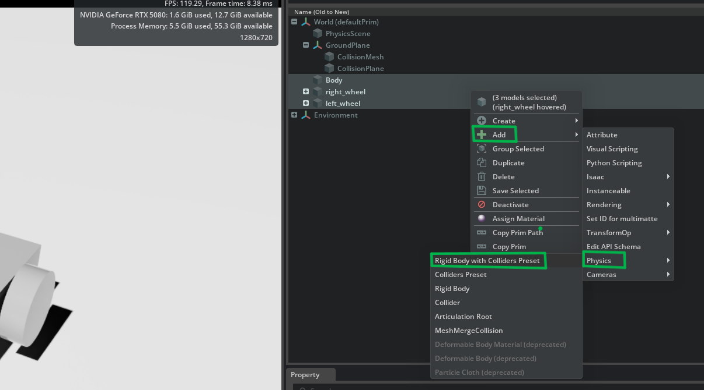

1. Select: body + wheels
2. Add: Physics → Rigid Body with Colliders

### 🔗 Add Wheel Joints

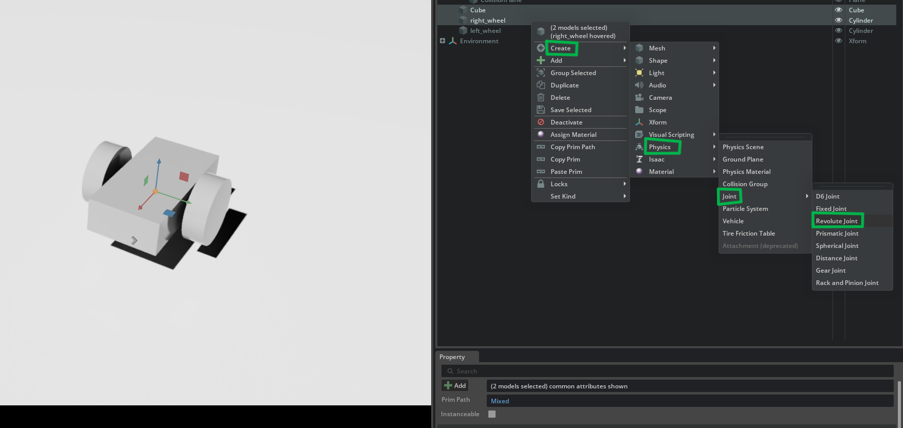

1. Select body + wheel
2. Create: Physics → Joint → Revolute Joint
3. Repeat for both wheels

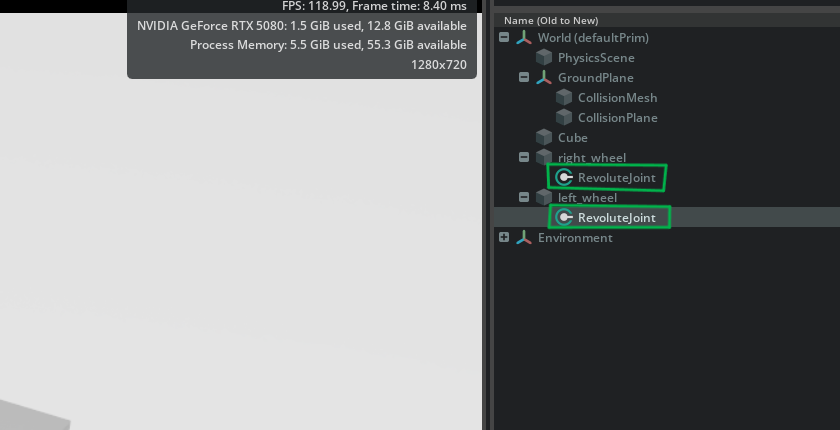  
_Creates a revolute joint to enable rotational motion between connected components, allowing the wheels to spin relative to the robot body._

### ⚙️ Configure Joints

  
_Set: Axis → Y_

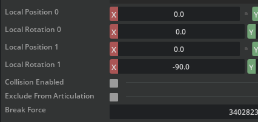  
_Local Rotation0 = 0 | Local Rotation1 X = -90_

### ▶️ Test Physics

Car falling on ground
Click Play ▶️
👉 Robot should fall onto ground
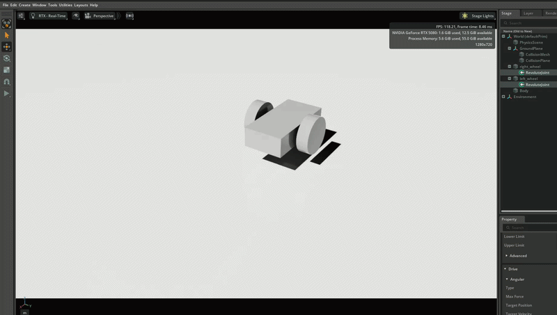

### ⚡ Add Movement

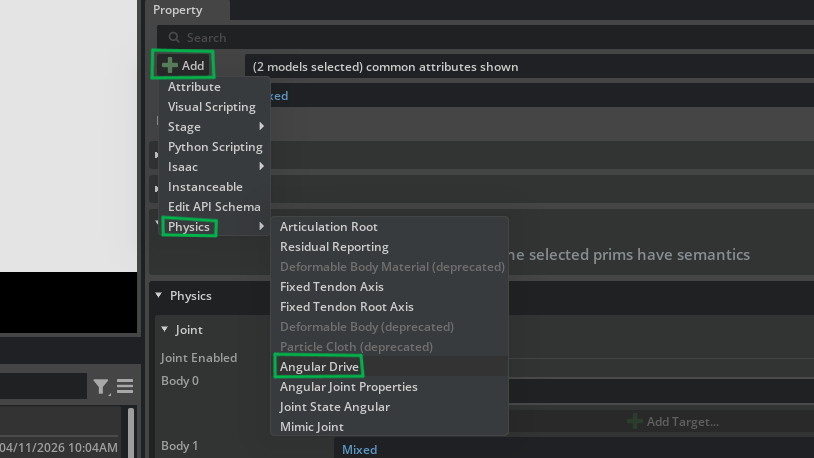

1. Select both joints
2. Add: Physics → Angular Drive

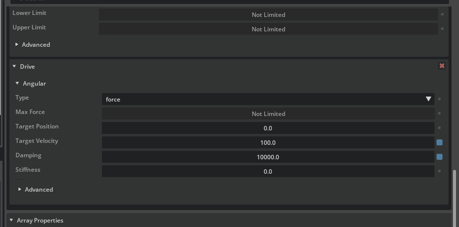  
_Set: Damping = 10000 | Target Velocity = 100_
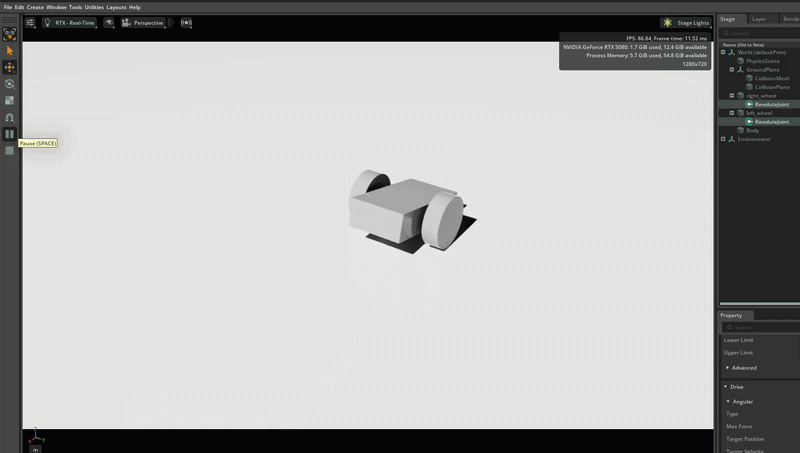

### ✅ Outcome

- Simple 2-wheel robot created
- Basic movement working
- Ready for further control integration

---

## ⚡ What to Do Next

- Enable ROS 2 Bridge in Isaac Sim
- Setup Action Graph with required nodes
- Configure /cmd_vel, wheel values & joints
- Run teleop and control using keyboard 🚗

### [⬅️ Previous](../README.md) | [Next ➡️](./ros2_keyboard.md)
