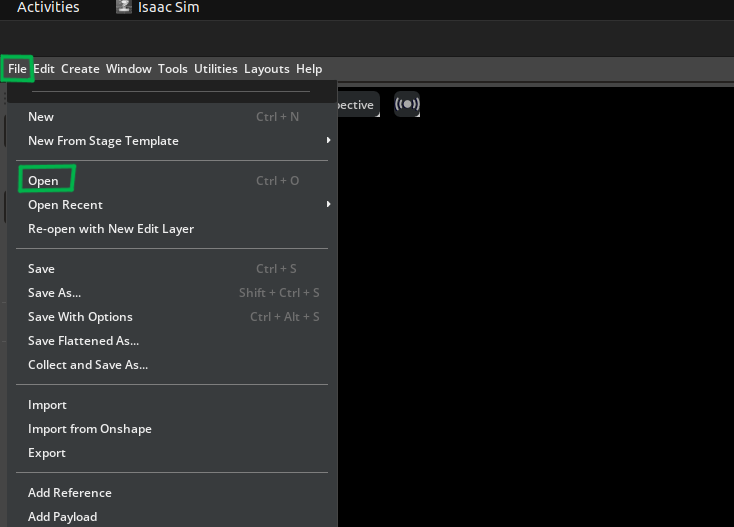
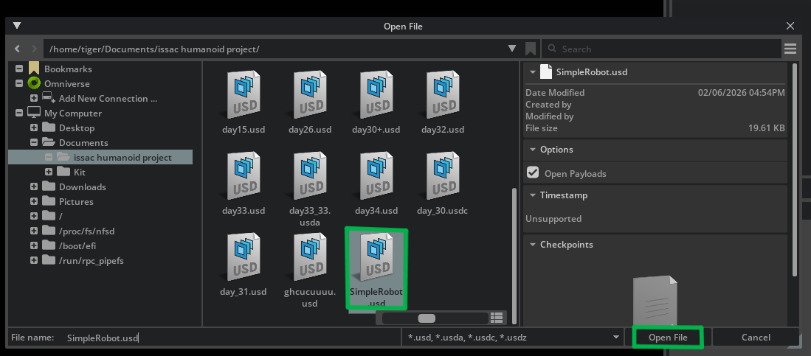
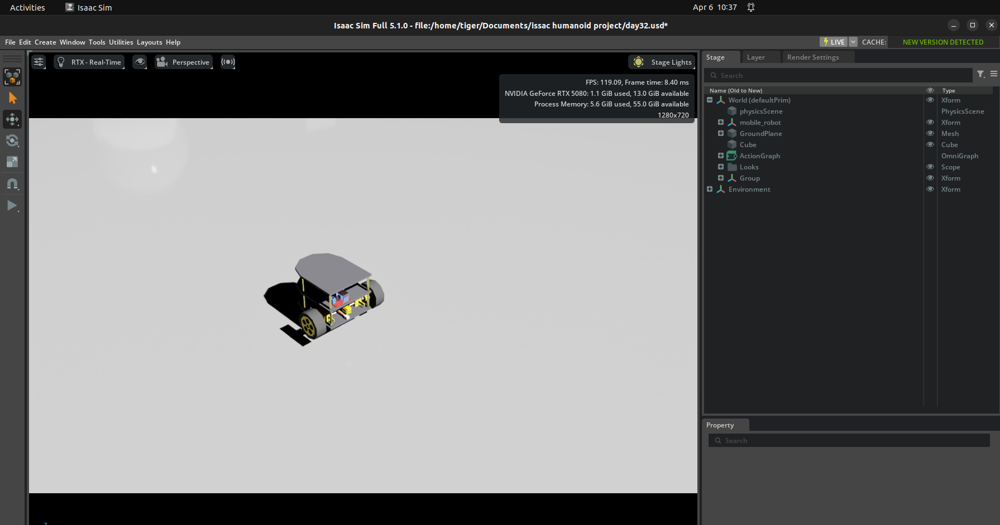

# 🚀 Using the Pre-Built Robot Model (Quick Start)

If you want to run the project quickly without building from scratch, you can directly use the provided USD model.

### ▶️ Steps to Load the Model

### 1.Download the USD model: [Download USD Model](../mobile_car.usd)

### 2.Open Isaac Sim.

### 3.Click: `File → Open`

### 4.Select the model file:

### 5.Open the file in the scene.

### ✅ Outcome

- Robot loads instantly in the simulation
- No need to manually build components
- Fastest way to start testing and control

---

## ⚡ What to Do Next

- Enable ROS 2 Bridge in Isaac Sim
- Setup Action Graph with required nodes
- Configure /cmd_vel, wheel values & joints
- Run teleop and control using keyboard 🚗

### [⬅️ Previous](../README.md) | [Next ➡️](./ros2_keyboard.md)
