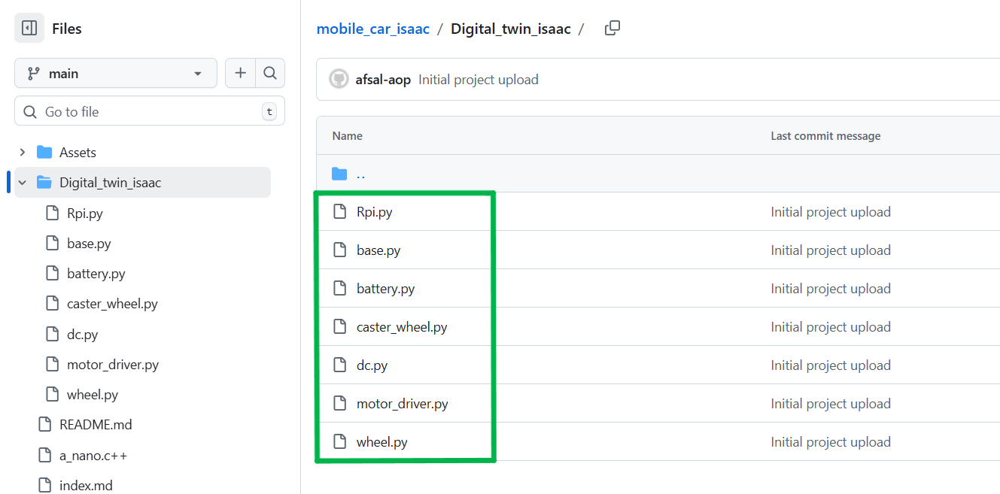
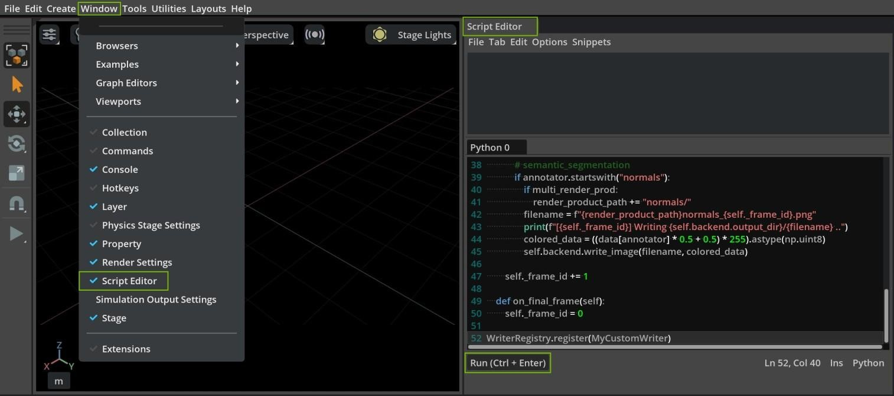

## 🧱 Building the Robot Programmatically (Python)

To achieve a more accurate and realistic model, the robot components are created using Python scripts with precise dimensions (length, width, height, and weight).

### All component scripts are available inside: `digital_twin_isaac/`

_Each file represents an individual part (wheel, base, motor, etc.), and the full robot can be generated using the main script._

---

### ▶️ Run Scripts in Isaac Sim

- Open Isaac Sim
- Go to:
  `Window → Script Editor`
- Select the Python tab
- Copy and paste any script (e.g., wheel.py, base.py, or car.py)
- Click **Run** ▶️

---

### ✅ Outcome

- Robot components are created with accurate dimensions
- Full model can be assembled programmatically
- Provides better control and scalability compared to manual modeling

---

## ⚡ What to Do Next

- Enable ROS 2 Bridge in Isaac Sim
- Setup Action Graph with required nodes
- Configure /cmd_vel, wheel values & joints
- Run teleop and control using keyboard 🚗

### [⬅️ Previous](../README.md) | [Next ➡️](./ros2_keyboard.md)
