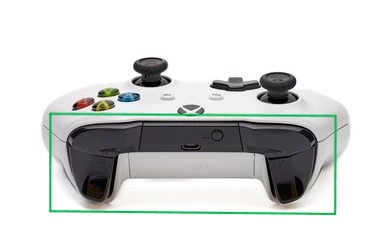
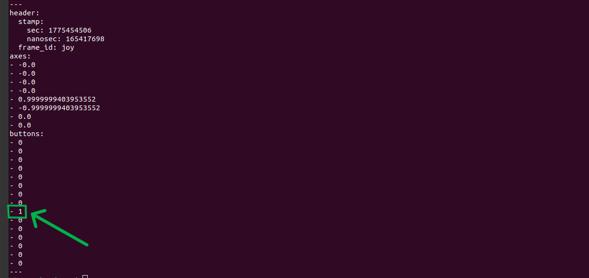
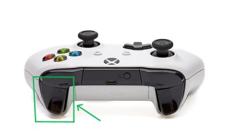
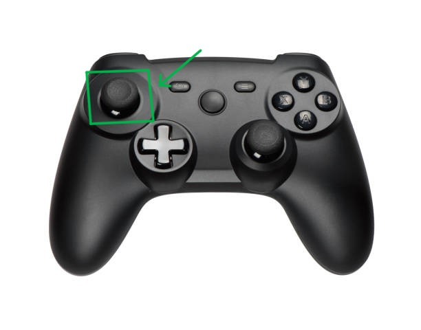

# 🎮 Joystick Control (Optional)

- You can control the robot using a joystick/game controller.
- If keyboard control is already working, no changes are required in the Action Graph.

### ⚙️ Install & Launch Joystick

**Open a new terminal:**

```bash
    sudo apt update
    sudo apt install ros-humble-joy ros-humble-teleop-twist-joy
    source /opt/ros/humble/setup.bash
    ros2 launch teleop_twist_joy teleop-launch.py
```

### 🔍 Verify Joystick Input

**Open another terminal:**

```bash
    source /opt/ros/humble/setup.bash
    ros2 topic echo /joy
```

- Press buttons on your controller
- Observe the buttons: values changing

### 🎯 Identify Deadman Switch

### 1.Press buttons one by one (R1, R2, L1, L2, etc.)



### 2.Find the button where value changes from 0 → 1 (typically index 8)



### 3.This button acts as the Deadman Switch

## 🚗 Control the Robot

### 1.Press and hold the Deadman Switch (eg:- F2)



### 2.Move the left joystick forward



### The robot will start moving in Isaac Sim


### ✅ Outcome

- Robot responds to joystick input
- Smoother and more natural control compared to keyboard

---

## ⚡ What to Do Next

- Install Ubuntu on Raspberry Pi using Imager
- Complete setup and connect to Wi-Fi
- Access Raspberry Pi via SSH
- Install ROS 2 and prepare environment 🍓

### [⬅️ Previous](./ros2_keyboard.md) | [Next ➡️](./rpi_setup.md)
