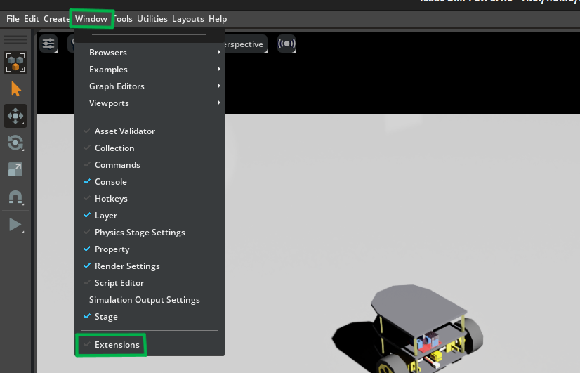
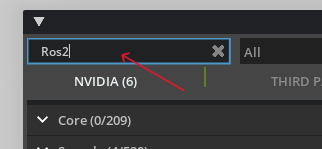
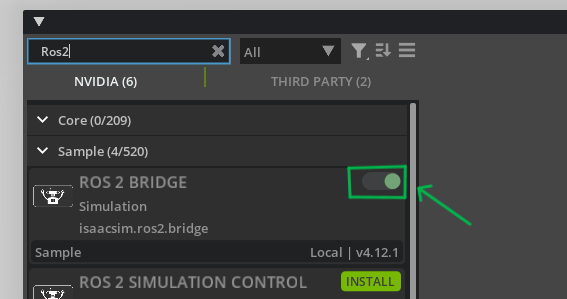
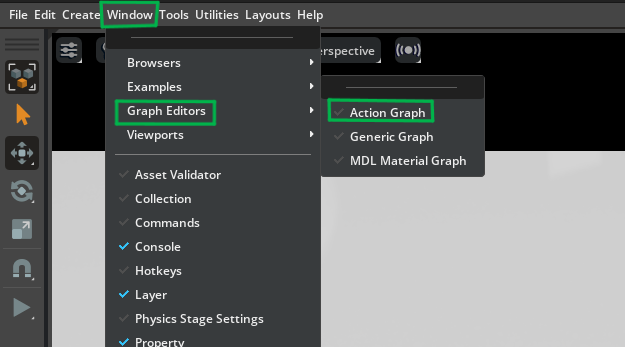
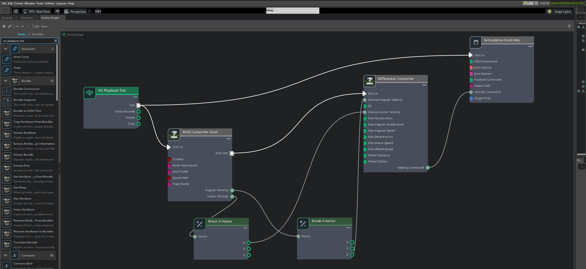
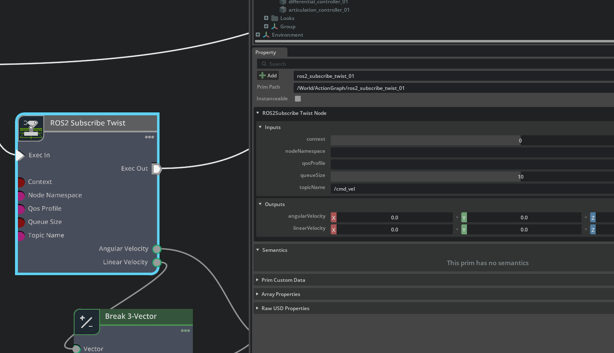
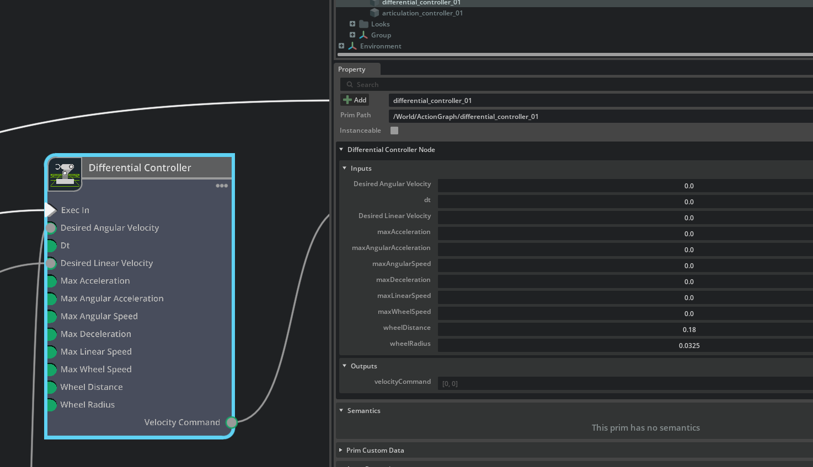
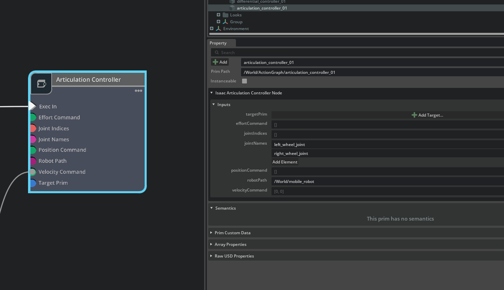
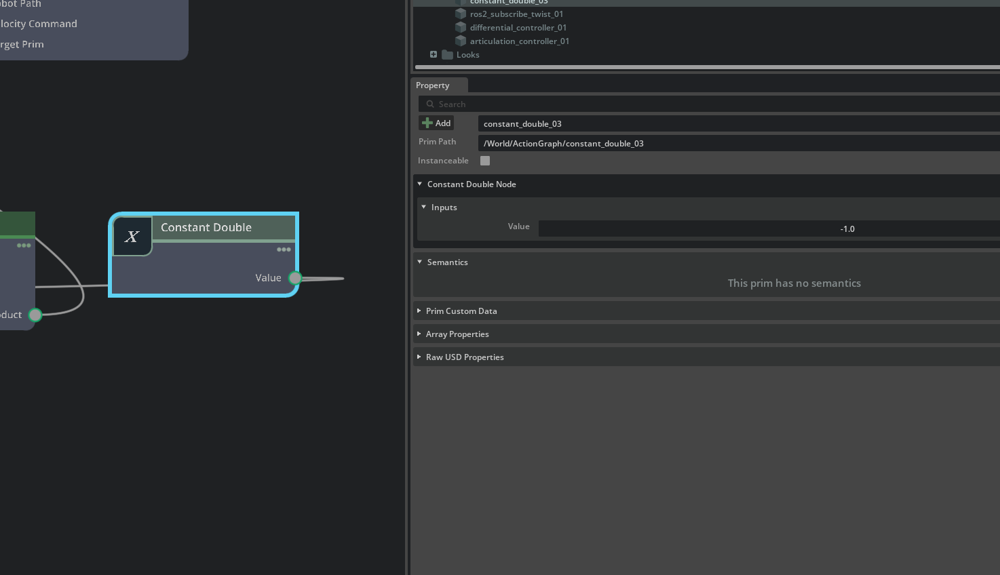
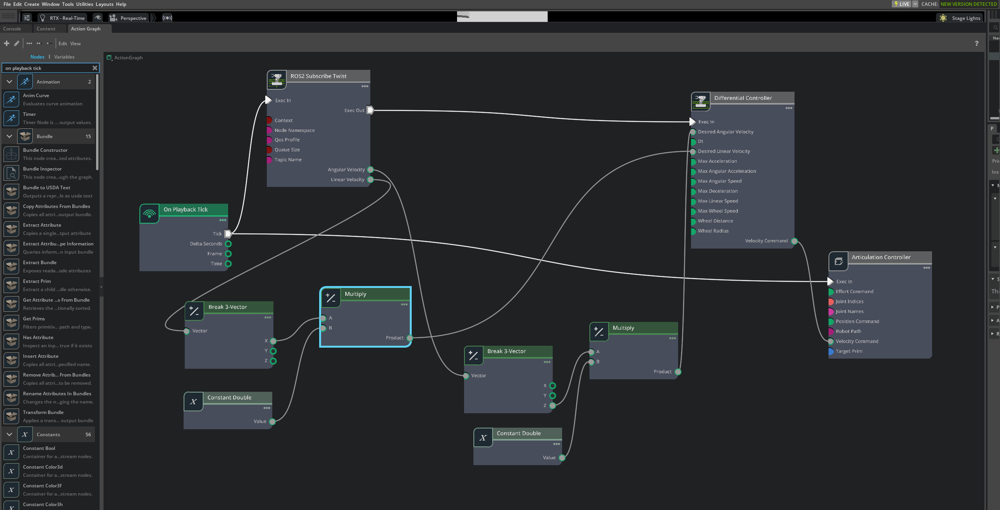

# ⌨️ Controlling the Robot using ROS 2 (Keyboard)

After building the robot, the next step is to connect it with ROS 2 and control it using the keyboard.

## 🔗 Enable ROS 2 Bridge

### 1.Open Isaac Sim

### 2.Go to: `Window → Extensions`



### 3.Search ROS2



### 4.Enable: `Omni.isaac.ros2_bridge`



## 🧩 Setup Action Graph

### 1.Go to:`Window → Graph Editors → Action Graph`



### 2.Create a new graph:


### 3.Add nodes:


- On Playback Tick
- ROS2 Subscribe Twist
- Differential Controller
- Articulation Controller

### 4.Connect them as shown in the image:



## ⚙️ Node Configuration (Configure each node as follows)

### 1.ROS2 Subscribe Twist



- Set Topic Name → /cmd_vel
- (Node ID can be left as default)
- 👉 This receives movement commands from ROS 2

### 2.Differential Controller



- Set Wheel Distance → distance between left & right wheels (e.g., 0.15)
- Set Wheel Radius → radius of wheel (e.g., 0.033)
- 👉 These values control how accurately the robot moves and turns

### 3.Articulation Controller



- Enable Use Path ✅
- Set Robot Path → select your robot (e.g., /World/TCE_Bot)
- Set Joint Names:  
  `["left_wheel_joint", "right_wheel_joint"]`
- 👉 Make sure names exactly match your wheel joints

### 4.Constant Double (Add if your robot moves backward when you press forward)



- Add Constant Double node
- Set Value: -1.0
- 👉 When to use this:
  - If your robot moves backward when you press forward
  - If wheel rotation direction is inverted
  - Connect them as shown in the image:



**⚠️ Note**  
Wrong wheel values → incorrect turning  
Wrong joint names → robot will not move

### ▶️ Run & Control

- Click Play ▶️ in Isaac Sim
- Open terminal:

```bash
    source /opt/ros/humble/setup.bash
    ros2 run teleop_twist_keyboard teleop_twist_keyboard
```

- Use keys:
  - i → forward
  - j / l → turn
  - k → stop

_✅ Result_  
Robot responds to keyboard input  
Moves forward, turns, and stops in simulation

---

## ⚡ What to Do Next

- Setup joystick control using ROS 2
- Verify controller input and identify deadman switch
- Launch teleop_twist_joy and connect controller
- Test smooth robot movement using joystick 🎮

### [⬅️ Previous](../README.md) | [Next ➡️](./ros2_joystick.md)
