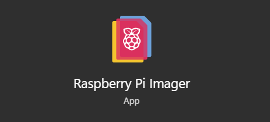
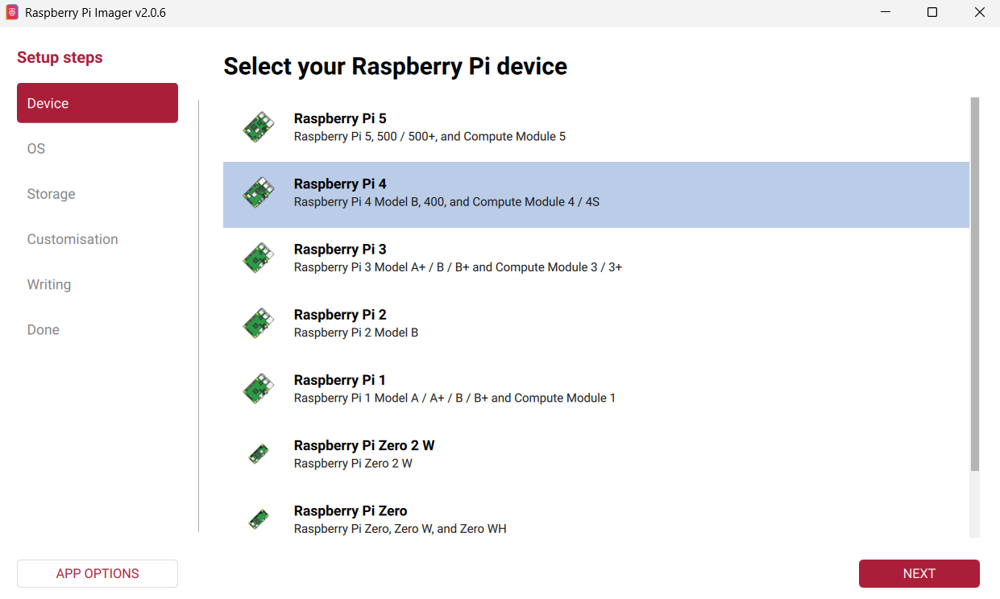
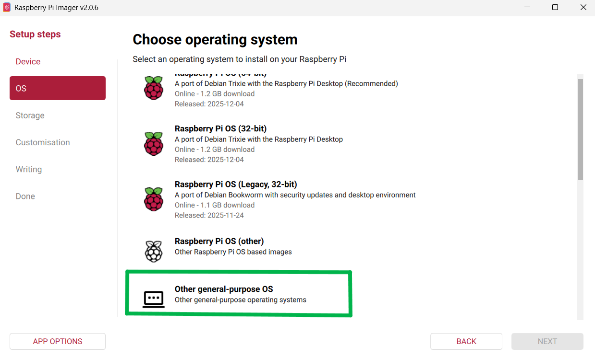
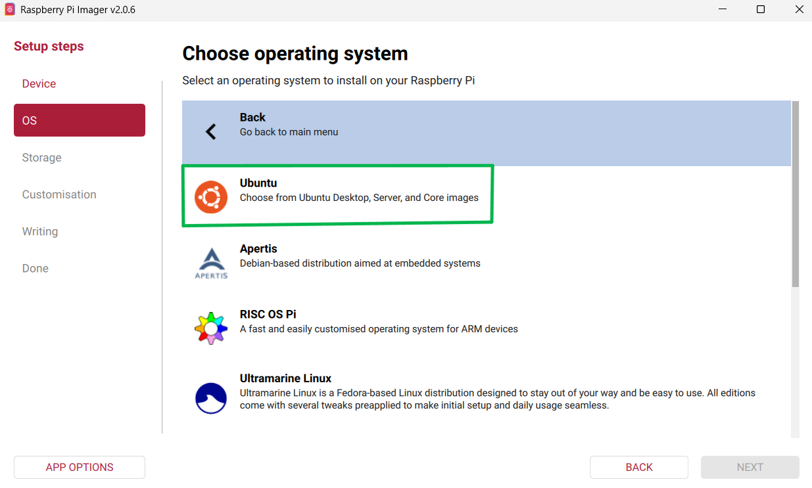
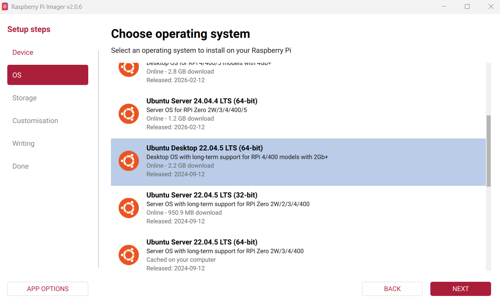
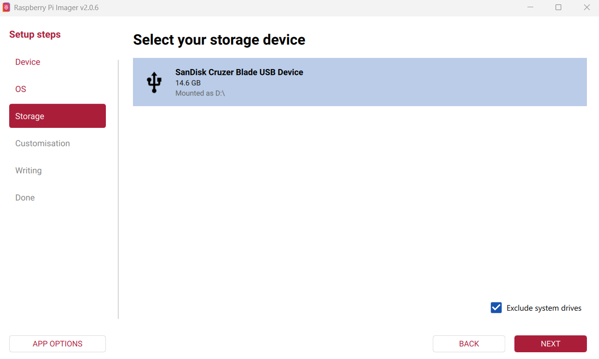
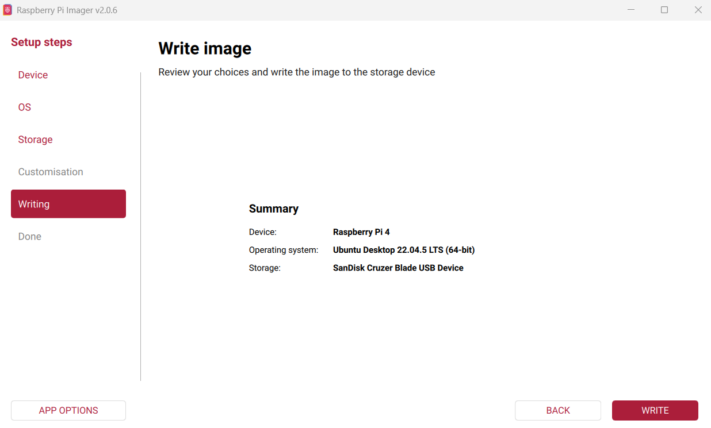
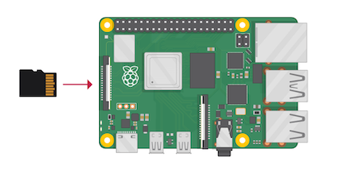

# 🍓 Raspberry Pi Setup (Ubuntu + ROS 2)

To run ROS 2 on the physical robot, you need to install Ubuntu OS on the Raspberry Pi and set up the environment.

## 💿 Flash Ubuntu (Using Raspberry Pi Imager)

### 1. Install and open Raspberry Pi Imager



### 2. Choose Device → Raspberry pi4



### 3. Choose OS → Other general-purpose OS



### 4. Select Ubuntu



### 5. Select Ubuntu Version → Ubuntu Desktop 22.04...(64-bit)



### 6. Choose Storage → Select your SD Card



### 7. Click Write and wait until the process completes



### ⚙️ Initial Setup

### 1.Insert the SD card into the Raspberry Pi



### 2.Power ON the device


### 3.Complete basic Ubuntu setup

### 4.Connect to the same Wi-Fi network as your PC

### 🔗 Connect via SSH

```bash
    ssh username@<your_ip_address>
```

- Replace with your actual username and IP address

- Example:
  `ssh raspi@192.168.247.85`

### 📦 Install ROS 2

```bash
    sudo apt update
    sudo apt install ros-humble-desktop
    source /opt/ros/humble/setup.bash
```

### ✅ Outcome

- Ubuntu successfully installed on Raspberry Pi
- ROS 2 environment ready
- Raspberry Pi accessible remotely via SSH

---

## ⚡ What to Do Next

- Assemble all hardware components and complete wiring
- Verify circuit connections using the diagram
- Power the system and check basic motor response
- Proceed with Raspberry Pi control and ROS 2 integration

### [⬅️ Previous](./ros2_joystick.md) | [Next ➡️](./bot_hardware.md)
