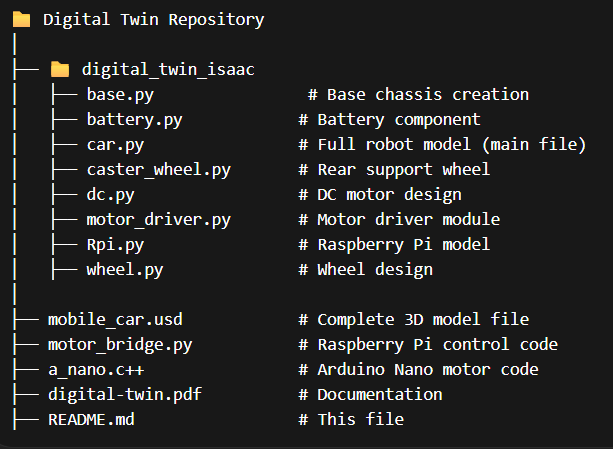

# Digital Twin Mobile Robot using Isaac Sim + ROS 2

### 📌 Overview
This project is a Digital Twin of a Two-Wheeled Mobile Robot built using NVIDIA Isaac Sim and integrated with ROS 2 (Humble).

#### This project is designed in such a way that:
- A beginner can understand and run it
- A developer can extend it
- A robotics learner can build their own robot
---
### 🧠 Project Architecture
The project consists of 3 main parts:
#### 1. 🖥️ Simulation (Isaac Sim)
- 3D robot model
- Physics simulation
- Sensors (Camera, LiDAR)
- Action Graph for control
#### 2. 🔗 Middleware (ROS 2)
- Communication bridge
- Topic-based control (/cmd_vel)
- Keyboard + Joystick input
#### 3. ⚙️ Hardware (Real Robot)
- Raspberry Pi (Ubuntu + ROS 2)
- Arduino Nano (Motor control)
- Buck Converter
- DC Motors + Motor Driver

---
###⚙️ Requirements
####🖥️ Software
Install the following:
- Ubuntu 22.04
- ROS 2 Humble
- NVIDIA Isaac Sim
- Python 3.10
