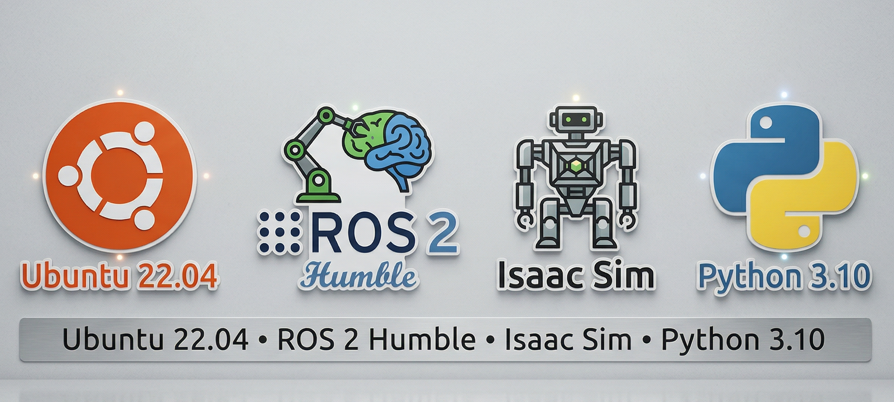
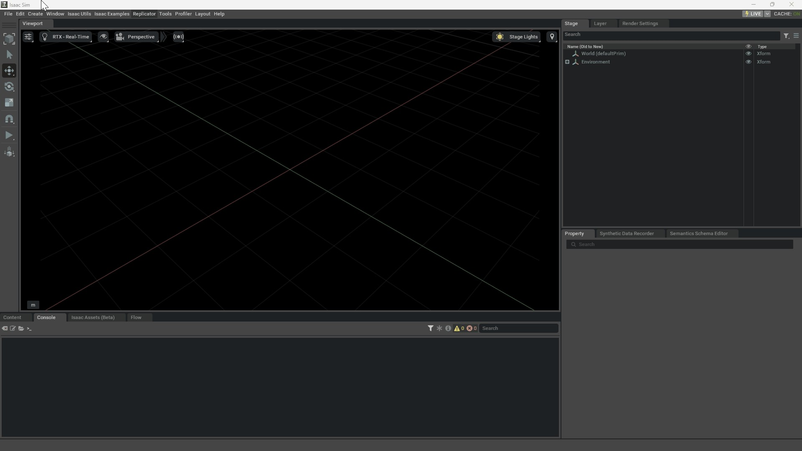

# Digital Twin Mobile Robot using Isaac Sim + ROS 2

## 📌 Overview

This project is a Digital Twin of a Two-Wheeled Mobile Robot built using NVIDIA Isaac Sim and integrated with ROS 2 (Humble).

### This project is designed in such a way that:

- A beginner can understand and run it
- A developer can extend it
- A robotics learner can build their own robot

## 🧠 Project Architecture

### The project consists of 3 main parts:

#### 1. 🖥️ Simulation (Isaac Sim)

- 3D robot model
- Physics simulation
- Sensors (Camera, LiDAR)
- Action Graph for control

#### 2. 🔗 Middleware (ROS 2)

- Communication bridge
- Topic-based control (/cmd_vel)
- Keyboard + Joystick input

#### 3. ⚙️ Hardware (Real Robot)

- Raspberry Pi (Ubuntu + ROS 2)
- Arduino Nano (Motor control)
- Buck Converter
- DC Motors + Motor Driver

## ⚙️ Requirements

Install the following:

## 1. 🖥️ Simulation (Isaac Sim)

### 🚀 Launching Isaac Sim

After successfully installing all the required software, the next step is to launch NVIDIA Isaac Sim with the ROS 2 environment properly configured.

### 📌 Step 1: Source ROS 2 Environment

Before opening Isaac Sim, you must source the ROS 2 setup file. This ensures that all ROS 2 commands and packages are available in your terminal session.

    source /opt/ros/humble/setup.bash

_⚠️ Important:_
This step must be performed every time you open a new terminal before working with ROS 2 or Isaac Sim.

### 📌 Step 2: Launch Isaac Sim

Navigate to your Isaac Sim installation directory and run the startup script.

    /home/tiger/isaac-sim/isaac-sim.sh

🔁 Replace `/home/tiger/isaac-sim/` with the actual path where Isaac Sim is installed on your system.

### ✅ Expected Result

- Isaac Sim application will launch
- You will see the main interface with viewport, stage, and tool panels
- The environment is now ready for simulation and ROS 2 integration

## 

## 🏗️ Robot Setup Options

### Option 1: [Use Pre-Built Model (Recommended)](./Assets/prebuilted.md)

### Option 2: [Build the Robot from Scratch (Using Python Scripts)](./Assets/python_script.md)

### Option 3: [Want to build the robot from scratch? (Manually)](./Assets/manual.md)

---
