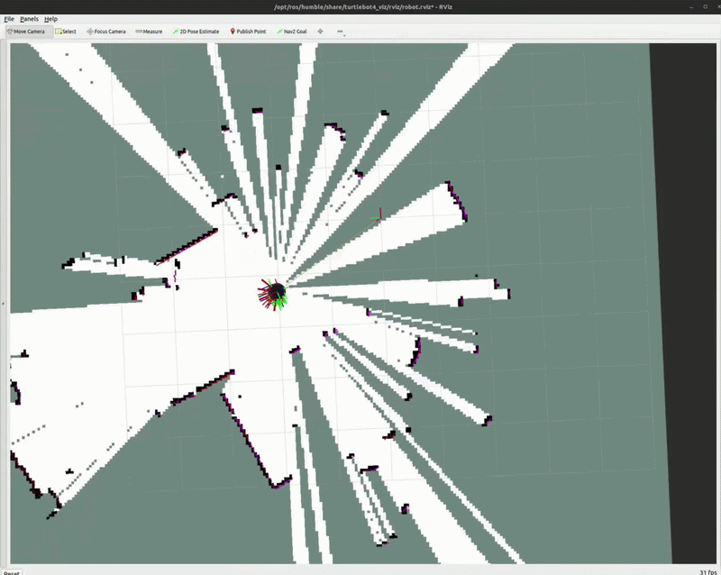
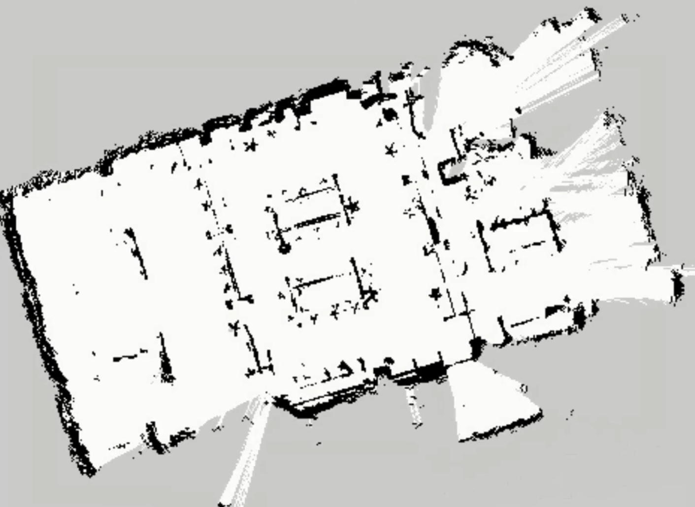
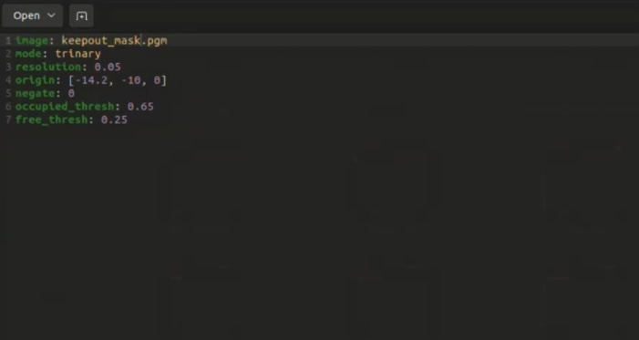
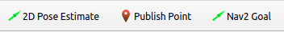
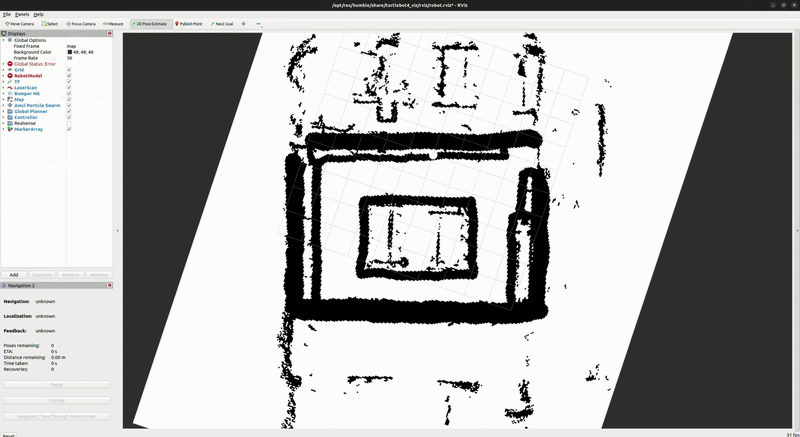

# 🐢 TurtleBot 4: Mapping and Navigation Guide

> This repository contains the workflow and commands used to perform SLAM (Simultaneous Localization and Mapping) and autonomous navigation using the **TurtleBot 4** on **ROS 2 Humble**.

---

## 🗺️ Phase 1: Generating a Map (SLAM)

Mapping allows the robot to build a 2D floor plan of its environment using its LiDAR sensor.

### 1. Installation

First, ensure the navigation packages are installed on your system:

```bash
sudo apt install ros-humble-turtlebot4-navigation
```

### 2. Launch SLAM

It is recommended to run **Synchronous SLAM** on a remote PC for higher resolution. In your terminal, run:

```bash
ros2 launch turtlebot4_navigation slam.launch.py
```

> [!TIP]
> If you have performance issues, you can run **Asynchronous SLAM** by adding `sync:=false`.

### 3. Visualize in RViz

To see the map building in real-time, launch the visualization tool on your desktop:

```bash
ros2 launch turtlebot4_viz view_robot.launch.py
```



### 4. Save the Map

Once the room is fully mapped, save the files (`.yaml` and `.pgm`) using the service call:

```bash
ros2 service call /slam_toolbox/save_map slam_toolbox/srv/SaveMap "name: data: 'my_map_name'"
```

### .pgm file:



### .yaml file:

## 

## 🚀 Phase 2: Autonomous Navigation

Once you have a saved map, you can tell the robot to navigate to specific coordinates.

### 1. Launch Localization

This step tells the robot where it is on the map you just created.

```bash
ros2 launch turtlebot4_navigation localization.launch.py map:=my_map_name.yaml
```

### 2. Launch Nav2

In a new terminal, start the Navigation 2 stack:

```bash
ros2 launch turtlebot4_navigation nav2.launch.py
```

### 3. Set a Goal in RViz

Launch the visualizer again to interact with the robot:

```bash
ros2 launch turtlebot4_viz view_robot.launch.py
```

### Steps to move:



1. Use **2D Pose Estimate** to align the robot's position on the map.
2. Use **Nav2 Goal** to click a point on the map where you want the robot to go.

### 2D Pose Estimate:



### Nav2 Goal:

## 
